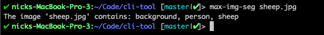

## `imageCat`  
### _like cat, but for images_

A Deep Learning Powered CLI tool.

### _NOTE: documentation and install methods currently in development_



For now, the script must be executed by node directly, as follows:
```
node app.js /path/to/image
```
where the path to an image file is provided as an argument.

**Developed for Python 2 environment.. Python 3 currently experimental/unsupported**